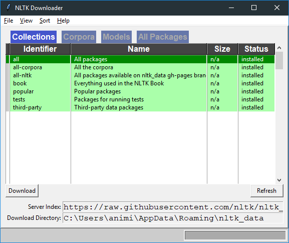

# Word Level Sentiment Analysis Model
This is  a simple program to conduct sentiment analysis on any given user input. This is my first Machine Learning model.

## Dependencies:
  1. Python 3
  2. NLTK (Natural Language Toolkit)
  3. Scikit-Learn (Sklearn)

## Installation for Python 3
Visit: https://www.python.org/downloads/ and download the version suitable for your System

## Installation for NLTK
Open Command Prompt (Windows) or Terminal (Linux) and type in the following command:
~~~     
pip install nltk
~~~

Open Python in Command Prompt and type
~~~python
import nltk

nltk.download()
~~~

The following window will appear:

 

Select "all" and click on "Download"

Visit: [NLTK Install Instructions](https://www.nltk.org/install.html) for details.

## Installation for Scikit-Learn
Open Command Prompt (Windows) or Terminal (Linux) and type in the following command:

~~~
pip install sklearn
~~~

Visit: [Scikit-learn Installation Documentation](https://scikit-learn.org/stable/install.html) for details.

## How to use?
1. Download the dataset from [HERE](https://pythonprogramming.net/static/downloads/short_reviews/) (Both `positive.txt` and `negative.txt`)
2. Put them in the desired path and change the path of the `train.py` and `test.py` accordingly.
3. Train the model (using `train.py`) and save the classifier by pickling it at the desired location.
4. You can directly run the classifier after training or load the saved classifier and run it later using the `test.py`
5. Input a word and press enter, the model would predict if the word is a positive one or negative. 
6. You can also input a sentence, however, it does not perform very accurately since it is a simple word based model
